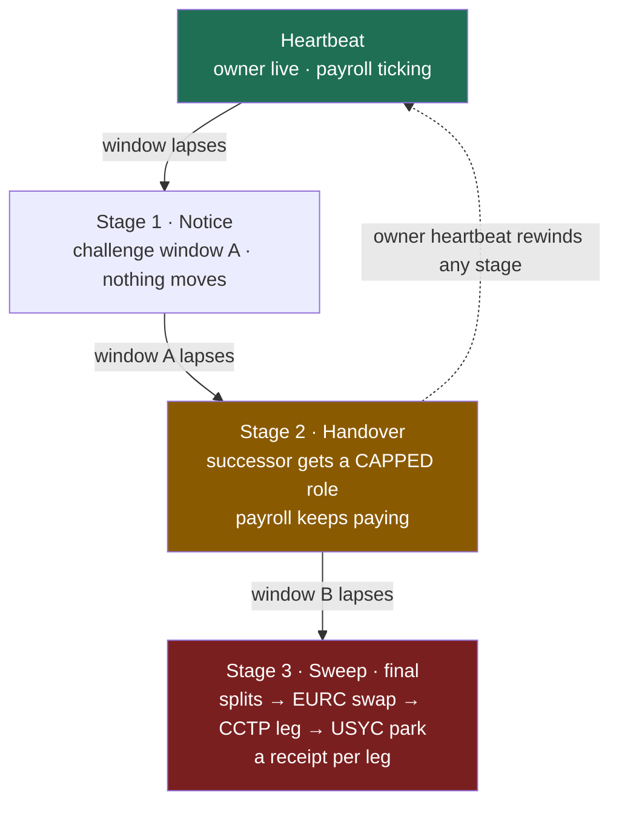

# Ephor — business continuity as programmable settlement

> **The state never stops.**

Ephor is a **continuity vault** for solo-founder and small-team businesses whose treasury lives onchain, built on **Arc**. The founder's wallet heartbeats on a schedule. Miss the window and a **staged, fully cancellable succession staircase** executes onchain — a public notice, then a *capped* operational handover to a designated successor, then a policy-driven treasury settlement — **while payroll never misses a beat.** One heartbeat from the returning owner rewinds the entire staircase.

Banks freeze accounts when the account-holder disappears. **Ephor does the exact opposite.**

Named for Sparta's five elected *ephors* — bounded, term-limited overseers charged above all with keeping the state running. Bounded authority + continuity + owner-supremacy, in one ancient office.

*Arc "Programmable Money" hackathon · DeFi track. This is **operational continuity, not probate** — the product keeps a business paying its people; it does not probate a will.*

---

## The two money-shots

1. **The founder goes silent — and the company keeps paying people.** Payroll executes on time through silence, through every succession stage, and after handover. It never misses.
2. **The founder returns — and one heartbeat rewinds everything.** A single heartbeat during handover cancels the staircase and restores sole control. The owner's live key always wins.

## The succession staircase



**Owner-supremacy is absolute until the final sweep executes.** Stage advancement is *permissionless* once a window lapses (anyone can call — liveness without trusting our keeper); *cancellation requires only the owner key.* That asymmetry is the security model. All windows are measured in **block counts** — Arc timestamps repeat, so blocks are the only trustworthy clock.

## Named invariants (the security spec — written before the code)

| | Invariant | Statement |
|---|---|---|
| INV-1 | **owner-supremacy** | a live owner heartbeat cancels any stage < 3-executed, always, in every fuzzed ordering |
| INV-2 | **stage monotonicity** | stages advance 0→1→2→3, never skip, never regress except by cancel-to-0 |
| INV-3 | **no early execution** | no stage action before its window lapses, measured in blocks |
| INV-4 | **split conservation** | Σ stage-3 allocations == 100% of swept balance, exactly, after fees |
| INV-5 | **cap safety** | successor spend ≤ per-tx **and** rolling-daily caps under fuzz |
| INV-6 | **payroll continuity** | reserve-funded payroll pulls succeed regardless of stage state |

## Repository layout

This repo is a pnpm + Foundry monorepo. **This is the contracts + backend half.** The interface (`apps/web`, `packages/ui`) is built by a separate, parallel session and is intentionally absent here until the UI handoff.

```
contracts/            Foundry · Solidity 0.8.24
  src/
    ContinuityVault.sol    funds; roles (owner, capped successor); payroll reserve + pulls; guardian-pausable
    SuccessionPlan.sol     plan config; heartbeat registry; monotonic cancellable stage machine; stage-3 executor
    Guardian2of3.sol       veto multisig + key-rotation authority
apps/keeper/          TS · watches windows, advances/executes idempotently, drives payroll, indexes events
packages/shared/      TS · EphorProvider interface, domain types, viem clients, Arc addresses, six scenarios
scripts/              deploy, seed demo company, fund wallets, scenario drivers, verify-receipts
docs/                 THREAT_MODEL, SECURITY, METRICS, CP2_SUBMISSION, INTEGRATION, DX_FEEDBACK
```

`packages/shared` exposes the **frozen** `EphorProvider` seam. The design session builds `MockEphorProvider` (deterministic fixtures + six one-keypress scenarios); this session ships `LiveEphorProvider`. Swapping mock↔live is a `DATA_MODE` flip with zero component changes.

## Status — CP2 (Jul 26)

| Area | State |
|---|---|
| Repo + GSD planning spine (PROJECT / ROADMAP / STATE / REQUIREMENTS) | ✅ |
| Monorepo scaffold (pnpm + Foundry + OpenZeppelin) | ✅ |
| **Phase 0** — `EphorProvider` interface + domain types + **six scenarios** (typechecks; unblocks design) | ✅ |
| **Phase 1** — `ContinuityVault` · `SuccessionPlan` · `Guardian2of3` + **81 tests / 6 invariants + end-to-end arc / 98.8% line cov** | ✅ |
| Keeper v1 skeleton (idempotent advance + payroll; runs six scenarios headlessly) | ✅ |
| Deploy + verify on Arc testnet (addresses below) | ⛔ needs Circle Console credentials (see Deployment) |
| Stage-3 multi-leg executor (Swap · CCTP · USYC) · live provider · Slither | 📋 Phase 2–3 |

See [`PROGRESS.md`](PROGRESS.md) for the date-stamped log and [`.planning/ROADMAP.md`](.planning/ROADMAP.md) for the full plan.

## Quickstart

```bash
pnpm install                 # workspace deps (Foundry deps are git submodules — see below)
git submodule update --init  # forge-std + OpenZeppelin, if you cloned without --recurse-submodules

pnpm --filter @ephor/shared typecheck   # validate the provider + scenarios
pnpm contracts:build                     # forge build
pnpm contracts:test                      # forge test (unit + fuzz + invariants)
```

Copy `.env.example` → `.env` and fill in values before any deploy. **Testnet only. Never a mainnet key. No secrets in git.**

## Deployment (Arc testnet)

| Contract | Address | Explorer |
|---|---|---|
| ContinuityVault | `TBD` | — |
| SuccessionPlan | `TBD` | — |
| Guardian2of3 | `TBD` | — |

> Deployment requires Circle Console credentials (`CIRCLE_API_KEY`, `CIRCLE_ENTITY_SECRET`) and a faucet-funded `DEPLOYER_PRIVATE_KEY`, supplied via environment variables only. The deploy + verify scripts are wired; addresses land here once credentials are provided. Chain **5042002** · RPC `https://rpc.testnet.arc.network` · explorer `https://testnet.arcscan.app` · faucet `https://faucet.circle.com`.

## Arc primitives used

Conditional payments (the purest version in the field) · onchain automation · multi-step settlement · **App Kit** Swap + Send legs · **CCTP v2** cross-chain (Arc domain 26 → Base Sepolia) · **USYC** yield park (with a labeled `MockYieldVault` fallback if entitlements gate minting). USDC-as-gas means a successor needs no gas token to keep the company running.

## Notes

- **Contributors:** commits are authored by the human maintainer only. AI co-author/tool trailers are disabled at the source and stripped by a `commit-msg` hook, with a `pre-push` gate as backstop (`.githooks/`). Activate on a fresh clone with `git config core.hooksPath .githooks`.
- Built with the GSD workflow (`.planning/`); subagents inherit the session model.

## License

MIT
